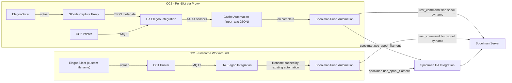

# Spoolman Integration

Track filament usage per spool by pushing data from this integration into [Spoolman](https://github.com/Donkie/Spoolman) via its REST API and the [Spoolman Home Assistant](https://github.com/Disane87/spoolman-homeassistant) integration.

There are three approaches depending on your printer and firmware:

| Printer | Firmware | Method | Per-Slot | Live Tracking |
|---------|----------|--------|----------|---------------|
| Centauri Carbon 2 | Stock | [Automated via gcode capture proxy](#centauri-carbon-2-automated-per-slot-tracking) | Yes (4 Canvas slots) | No (on complete) |
| Centauri Carbon | OpenCentauri | [Total Extrusion sensor](#centauri-carbon-with-opencentauri-firmware) | No (single spool) | Yes (every 100mm) |
| Centauri Carbon | Stock | [Filename template workaround](#centauri-carbon-stock-firmware-filename-workaround) | No (single spool) | No (on complete) |

All approaches require:

* [Spoolman Home Assistant](https://github.com/Disane87/spoolman-homeassistant) integration installed and configured
* Spoolman filament `name` values that match the filament preset names in ElegooSlicer
* A `rest_command` in `configuration.yaml` for the CC2/CC1 automations to query the Spoolman API (see [prerequisites](#prerequisites) below)

---

## Centauri Carbon 2 — Automated Per-Slot Tracking

### Architecture



Uses the [cc2-gcode-capture-proxy](https://github.com/lantern-eight/cc2-gcode-capture-proxy) to capture per-slot filament data from each uploaded gcode file. The proxy parses `; filament used [g]` and `; filament_settings_id` from the gcode to determine how much each Canvas slot uses and what filament is loaded.

The integration exposes this data as sensors when the proxy URL is configured (Settings → Integrations → Elegoo → Configure):

**Proxy-only sensors** (created only when a proxy URL is configured):
* `sensor.centauri_carbon_2_a1_grams` through `a4_grams` — per-slot planned weight
* `sensor.centauri_carbon_2_a1_cubic_centimeters` through
  `a4_cubic_centimeters` — per-slot volume
* `sensor.centauri_carbon_2_a1_length_millimeters` through
  `a4_length_millimeters` — per-slot filament length
* `sensor.centauri_carbon_2_total_filament_cost` — total cost from slicer settings
* `sensor.centauri_carbon_2_total_filament_changes` — number of
  filament changes in the print

**Canvas sensors** (always created for CC2, enhanced by proxy data when available):
* `sensor.centauri_carbon_2_a1_name` through `a4_name` — filament
  preset name (proxy names take priority, falls back to MQTT file
  detail, then Canvas tray data)
* `sensor.centauri_carbon_2_a1_color` through `a4_color` — filament
  hex color (from MQTT file detail or Canvas tray)

### How it works

1. ElegooSlicer uploads gcode through the proxy → proxy saves per-slot metadata
2. HA integration fetches proxy data when a print starts → per-slot sensors populate
3. A cache automation saves the slot data to an `input_text` helper (slot sensors clear to "unknown" on print complete)
4. On print complete, the push automation reads the cached data, matches each filament name to a Spoolman spool, and calls `spoolman.use_spool_filament`

### Prerequisites

* [cc2-gcode-capture-proxy](https://github.com/lantern-eight/cc2-gcode-capture-proxy) running and configured
* Proxy URL configured in the integration options
* Spoolman filament names matching ElegooSlicer filament preset names
* The following `rest_command` added to your `configuration.yaml` (reload or restart HA after adding):
    - The automations query the Spoolman server directly via rest_command for spool lookup, then use the HA service for deduction

```yaml
rest_command:
  spoolman_find_spools_by_name:
    url: "http://YOUR_SPOOLMAN_HOST:7912/api/v1/spool?filament.name={{ filament_name | urlencode }}&allow_archived=false"
    method: GET
    content_type: "application/json"
```

### Required helper

Create in Settings → Devices & Services → Helpers:

* **Cached CC2 Slot Data** — Input Text (`input_text.centauri_carbon_2_cached_slot_data`) with max length 255

### Optional: Per-slot Spoolman remaining weight sensors

These template sensors cross-reference each Canvas slot's filament
name against Spoolman to show how much filament remains on the
matching spool. Useful for dashboards — you can see at a glance
whether any loaded spool is running low before starting a print.

```yaml
template:
  - sensor:
      - name: "Centauri Carbon 2 A1 Spoolman Grams"
        unique_id: centauri_carbon_2_a1_spoolman_grams
        unit_of_measurement: "g"
        state: >
          
          
            unknown
          
            
            {{ match[0].attributes.remaining_weight | float(0) | round(1)
               if match | length > 0 else 'unknown' }}
          
        attributes:
          slot_name: "{{ states('sensor.centauri_carbon_2_a1_name') }}"
          slot_color: "{{ states('sensor.centauri_carbon_2_a1_color') }}"
```

Repeat for A2–A4 (change `a1` to `a2`, `a3`, `a4` in each
sensor). These sensors pick the spool with the highest remaining
weight when multiple spools share the same filament name.

### Shared script: Update Spoolman From Filament Name

Both the CC2 and CC1 automations use this reusable script. It
queries the Spoolman REST API directly for non-archived spools
matching the filament name, then **cascades** the deduction across
them: lowest remaining weight first (random tie-break for equal
weights), draining each spool to 0 before moving to the next,
until the full usage is exhausted.

If no spool matches, a persistent notification is created. If the
total available across all matching spools is less than the usage,
every matching spool is drained to 0 and an "insufficient spool
weight" notification fires with the unaccounted gram count.

> **Why REST instead of HA entities?** The Spoolman HA integration
> (as of v1.3.0) creates filament-level entities
> (`sensor.spoolman_filament_N`), and may not create spool-level
> entities. The filament entity's `id` attribute is a filament ID,
> not a spool ID — passing it to `use_spool_filament` would deduct
> from the wrong spool. Querying the REST API returns actual spool
> objects with correct spool IDs.

```yaml
update_spoolman_from_filament_name:
  alias: Update Spoolman From Filament Name
  mode: queued
  max: 10
  fields:
    filament_name:
      required: true
      name: Filament Name
      description: Must match the Spoolman filament name exactly.
      selector:
        text:
    use_weight:
      required: true
      name: Use Weight (grams)
      selector:
        number:
          min: 0
          max: 100000
          step: 0.01
          unit_of_measurement: g
  sequence:
    - action: rest_command.spoolman_find_spools_by_name
      data:
        filament_name: "{{ filament_name }}"
      response_variable: spool_response

    # Build the cascade list: keep spools with positive remaining_weight,
    # attach a random _jitter, sort by jitter then by remaining_weight.
    # Jinja's sort is stable, so the second sort preserves random order
    # within each weight tier (e.g. five 1000g spools end up in random
    # order).
    - variables:
        sorted_spools: >
          
          
          
          
            
            
              
            
          
          {{ (ns.items | sort(attribute='_jitter'))
                | sort(attribute='remaining_weight') }}
        total_available: >
          
          
          {{ spools | map(attribute='remaining_weight')
                   | map('float', 0) | sum | round(4) }}
        remaining_use: "{{ use_weight | float(0) | round(4) }}"

    - choose:
        # No candidate spools: warn and bail.
        - conditions:
            - condition: template
              value_template: "{{ sorted_spools | length == 0 }}"
          sequence:
            - action: persistent_notification.create
              data:
                title: "Spoolman: No matching spool"
                message: >
                  Could not find a non-archived Spoolman spool with filament
                  name "{{ filament_name }}". The print used {{ use_weight }}g
                  that was not tracked.

        # Cascade: walk sorted spools, draining each to 0 before moving on
        # until remaining_use is exhausted.
        - conditions:
            - condition: template
              value_template: "{{ sorted_spools | length > 0 }}"
          sequence:
            - repeat:
                for_each: "{{ sorted_spools }}"
                sequence:
                  - variables:
                      spool_remaining: >-
                        {{ repeat.item.remaining_weight
                           | float(0) | round(4) }}
                      to_deduct: >-
                        {{ 0 if (remaining_use | float(0)) <= 0
                              else ([remaining_use | float(0),
                                     spool_remaining | float(0)] | min) }}
                  - choose:
                      - conditions:
                          - condition: template
                            value_template: "{{ to_deduct | float(0) > 0 }}"
                        sequence:
                          - action: spoolman.use_spool_filament
                            data:
                              id: "{{ repeat.item.id | int }}"
                              use_weight: "{{ to_deduct | float(0) | round(2) }}"
                          - variables:
                              remaining_use: >-
                                {{ ((remaining_use | float(0))
                                    - (to_deduct | float(0)))
                                   | round(4) }}

            # Insufficient total: every matching spool was drained to 0 but
            # there's still unaccounted usage.
            - choose:
                - conditions:
                    - condition: template
                      value_template: "{{ (remaining_use | float(0)) > 0.01 }}"
                  sequence:
                    - action: persistent_notification.create
                      data:
                        title: "Spoolman: Insufficient spool weight"
                        message: >
                          Print used {{ use_weight }}g of "{{ filament_name }}"
                          but only {{ total_available }}g was available across
                          {{ sorted_spools | length }} spool(s). All matching
                          spools drained to 0;
                          {{ (remaining_use | float(0)) | round(2) }}g
                          unaccounted. Verify physical spools and adjust
                          Spoolman manually.
```

### Automation: Cache CC2 Slot Data

Caches the per-slot filament names and grams as JSON into the `input_text` helper whenever the proxy sensors populate. Required because the sensors clear to "unknown" on print complete.

```yaml
alias: Cache CC2 Slot Data
mode: single
triggers:
  - entity_id:
      - sensor.centauri_carbon_2_a1_grams
    trigger: state
conditions:
  - condition: template
    value_template: >
      {{ trigger.to_state.state not in ['unknown', 'unavailable'] }}
actions:
  - action: input_text.set_value
    target:
      entity_id: input_text.centauri_carbon_2_cached_slot_data
    data:
      value: >
        
        
        
        
        {{ {
          'a1': {'name': '' if n1 in ['unknown','unavailable'] else n1,
                 'grams': states('sensor.centauri_carbon_2_a1_grams') | float(0) | round(2)},
          'a2': {'name': '' if n2 in ['unknown','unavailable'] else n2,
                 'grams': states('sensor.centauri_carbon_2_a2_grams') | float(0) | round(2)},
          'a3': {'name': '' if n3 in ['unknown','unavailable'] else n3,
                 'grams': states('sensor.centauri_carbon_2_a3_grams') | float(0) | round(2)},
          'a4': {'name': '' if n4 in ['unknown','unavailable'] else n4,
                 'grams': states('sensor.centauri_carbon_2_a4_grams') | float(0) | round(2)}
        } | to_json }}
```

### Automation: CC2 Spoolman Update

On print complete, reads the cached slot data and pushes usage to Spoolman for each slot that consumed filament.

```yaml
alias: CC2 Spoolman Update
mode: single
triggers:
  - entity_id:
      - sensor.centauri_carbon_2_print_status
    to: complete
    trigger: state
conditions: []
actions:
  - variables:
      raw_data: "{{ states('input_text.centauri_carbon_2_cached_slot_data') }}"
  - choose:
      - conditions:
          - condition: template
            value_template: >
              {{ raw_data not in ['unknown', 'unavailable', '', 'None'] }}
        sequence:
          - variables:
              slot_data: "{{ raw_data if raw_data is mapping else raw_data | from_json }}"
          - repeat:
              for_each:
                - a1
                - a2
                - a3
                - a4
              sequence:
                - choose:
                    - conditions:
                        - condition: template
                          value_template: >
                            
                            {{ slot.grams | float(0) > 0
                               and slot.name not in ['', none, 'None'] }}
                      sequence:
                        - action: script.update_spoolman_from_filament_name
                          data:
                            filament_name: "{{ slot_data[repeat.item].name }}"
                            use_weight: "{{ slot_data[repeat.item].grams | float | round(2) }}"
    default:
      - action: persistent_notification.create
        data:
          title: "Spoolman: CC2 no cached slot data"
          message: >
            CC2 print completed but no cached slot data was found.
            Filament usage was not tracked. Make sure the gcode capture
            proxy is configured and the "Cache CC2 Slot Data" automation
            is enabled.
```

---

## Centauri Carbon — Stock Firmware Filename Workaround

For the Centauri Carbon on stock firmware (no OpenCentauri), there is no Total Extrusion sensor. This workaround embeds the filament name and planned weight into the filename using ElegooSlicer template variables, then parses them on print complete.

### ElegooSlicer setup

Set the output filename format in your CC1 printer profile to:

```
[anything]_{filament_preset[0]}_{total_weight}g
```

This produces filenames like `CC1_benchy_ElegooPLA-Basic-White_2.50g.gcode`. The `CC1_` prefix comes from naming your model files with that prefix (e.g. `CC1_benchy.stl`).

**Parsing relies on filament preset names being hyphenated (no underscores).** Model names can contain underscores. The parser splits from the right: the last `_`-separated token is the weight (`2.50g`), the second-to-last is the filament name (`ElegooPLA-Basic-White`).

The `{total_weight}` and `{filament_preset[0]}` variables are available in ElegooSlicer filename templates.

### Prerequisites

* The shared `script.update_spoolman_from_filament_name` from the [CC2 section above](#shared-script-update-spoolman-from-filament-name)
* An `input_text` helper: `input_text.centauri_carbon_last_file` (max length 255)
* The "Cache 3D Print Filename" automation below — the printer's
  `file_name` sensor clears on print complete, so the filename
  must be cached when it first appears

### Automation: Cache 3D Print Filename

Caches the filename from the printer's `file_name` sensor into an
`input_text` helper when a new job is loaded. Both the CC1 Spoolman
automation and notification automations read this helper after the
print completes (by which time the printer's own sensor has
cleared).

```yaml
alias: Cache 3D Print Filename
mode: parallel
triggers:
  - entity_id:
      - sensor.centauri_carbon_file_name
    trigger: state
conditions:
  - condition: template
    value_template: >
      {{ trigger.to_state.state
            not in ['unknown', 'Unknown', 'unavailable', 'Unavailable', ''] }}
actions:
  - action: input_text.set_value
    target:
      entity_id: input_text.centauri_carbon_last_file
    data:
      value: "{{ trigger.to_state.state }}"
```

> **Tip:** If you have multiple printers, add all `file_name`
> sensor entities to the trigger list and use a template for the
> target entity ID:
> ```yaml
> target:
>   entity_id: >
>     input_text.{{ trigger.entity_id
>       | replace('sensor.','')
>       | replace('_file_name','_last_file') }}
> ```

### Automation: CC1 Spoolman Update

```yaml
alias: CC1 Spoolman Update
mode: single
triggers:
  - entity_id:
      - sensor.centauri_carbon_print_status
    to: complete
    trigger: state
conditions: []
actions:
  - variables:
      filename: >
        {{ states('input_text.centauri_carbon_last_file') | replace('.gcode', '') }}
      parts: "{{ filename.split('_') }}"
      weight_grams: "{{ parts[-1] | replace('g', '') | float(0) }}"
      filament_name: "{{ parts[-2] | default('') }}"
  - choose:
      - conditions:
          - condition: template
            value_template: >
              {{ weight_grams > 0
                 and filament_name != ''
                 and '-' in filament_name }}
        sequence:
          - action: script.update_spoolman_from_filament_name
            data:
              filament_name: "{{ filament_name }}"
              use_weight: "{{ weight_grams | float | round(2) }}"
    default:
      - action: persistent_notification.create
        data:
          title: "Spoolman: CC1 filename parse failed"
          message: >
            Could not parse filament name and weight from filename
            "{{ states('input_text.centauri_carbon_last_file') }}".
            Expected format: [model]_[FilamentName-With-Hyphens]_[weight]g.gcode
```

---

## Centauri Carbon with OpenCentauri Firmware

The Total Filament Used sensor is available on the Centauri Carbon with the [OpenCentauri](https://docs.opencentauri.cc/patched-firmware/) firmware (and on the stock Centauri Carbon 2 firmware). This enables live tracking — usage is pushed to Spoolman every 100mm of extruded filament during a print.

When using the Centauri Carbon, install OpenCentauri firmware first. Only the patched version is required. If you already had this integration installed before installing OpenCentauri, remove and re-add your printer so the Total Filament Used sensor is made available.

> **Note:** The automations below use manual spool ID selection. They have not been tested with the Centauri Carbon 2 and filament change is not automated. For the CC2, consider using the [automated per-slot tracking](#centauri-carbon-2-automated-per-slot-tracking) instead.

### Required helpers

* **Current Spool ID** — Input Number (`input_number.current_spool_id`) with min 0, max 1000000
* **Current Spool** — Template Select (`select.current_spool`) for user-friendly spool selection:
    * State:
    ```jinja
     
     
     {{ '0: Unknown' }}
     
     
     
     
     
     
     
     
     
     
     
     
     {{ id ~ ': ' + vendor + ' ' + material + ' ' + name + ' (' + extra + ')' }}
     
    ```
    * Available Options:
    ```jinja
     
     
     
     
     
     
     
     
     
     
     
     
     
     {{ ns.x }}
    ```
    * Actions on Select
       - Action: Input Number: Set
          - Target: Current Spool ID
          - Value:
           ```jinja2
           {{ option.split(':')[0]|int }}
           ```

* **Accumulated Spool Usage** — Input Number (`input_number.accumulated_spool_usage`) with min 0, max 1000000
* **Diff Accumulated Spool Usage** — Template Number (`number.diff_accumulated_spool_usage`), min 0, max 1000000, unit mm:
    ```jinja
    {{ states('sensor.centauri_carbon_total_extrusion')  | float(0) - states('input_number.accumulated_spool_usage') | float(0) }}
    ```

### Script: Update Spool Usage

```yaml
sequence:
  - action: spoolman.use_spool_filament
    metadata: {}
    data:
      id: "{{ states(current_spool_id) }}"
      use_length: "{{ states(current_extrusion) }}"
fields:
  current_spool_id:
    required: true
    selector:
      entity:
        multiple: false
        filter:
          domain: input_number
    name: Current Spool ID
  current_extrusion:
    required: true
    selector:
      entity:
        multiple: false
        filter:
          domain: number
    name: Current Extrusion
alias: Update Spool Usage
description: ""
mode: queued
max: 100
```

### Automation: Update Spool Usage

Updates every 100mm of extruded filament during a print, and pushes the final usage when printing is done:

```yaml
alias: Update Spool Usage
description: ""
triggers:
  - trigger: state
    entity_id:
      - sensor.centauri_carbon_total_extrusion
    id: extrusion
  - trigger: state
    entity_id:
      - sensor.centauri_carbon_print_status
    id: idle
    from:
      - printing
    to:
      - idle
  - trigger: state
    entity_id:
      - sensor.centauri_carbon_print_status
    id: complete
    from:
      - printing
    to:
      - complete
  - trigger: state
    entity_id:
      - sensor.centauri_carbon_print_status
    id: stopped
    to:
      - stopped
conditions:
  - condition: numeric_state
    entity_id: input_number.current_spool_id
    above: 0
actions:
  - choose:
      - conditions:
          - condition: numeric_state
            entity_id: number.diff_accumulated_spool_usage
            above: 100
          - condition: trigger
            id:
              - extrusion
        sequence:
          - action: script.update_spool_usage
            metadata: {}
            data:
              current_spool_id: input_number.current_spool_id
              current_extrusion: number.diff_accumulated_spool_usage
          - action: input_number.set_value
            metadata: {}
            target:
              entity_id: input_number.accumulated_spool_usage
            data:
              value: >-
                {{ states('sensor.centauri_carbon_total_extrusion') | float(0)
                }}
      - conditions:
          - condition: trigger
            id:
              - idle
              - complete
              - stopped
          - condition: numeric_state
            entity_id: number.diff_accumulated_spool_usage
            above: 0
        sequence:
          - action: script.update_spool_usage
            metadata: {}
            data:
              current_spool_id: input_number.current_spool_id
              current_extrusion: number.diff_accumulated_spool_usage
          - action: input_number.set_value
            metadata: {}
            target:
              entity_id: input_number.accumulated_spool_usage
            data:
              value: "{{ float(0) }}"
        alias: If it's no longer printing
mode: queued
max: 1000
```

### Automation: Auto Reset Spool ID

Resets the spool ID when filament loading/unloading is detected (prevents tracking usage against the wrong spool):

```yaml
alias: Auto Reset Spool ID
description: ""
triggers:
  - trigger: state
    entity_id:
      - sensor.centauri_carbon_current_status
    to:
      - loading_unloading
conditions: []
actions:
  - action: input_number.set_value
    metadata: {}
    target:
      entity_id: input_number.current_spool_id
    data:
      value: 0
mode: single
```

### Automation: Prompt User For Spool ID Before Printing

Pauses the print at the beginning if no spool ID is set:

```yaml
alias: Prompt User For Spool ID Before Printing
description: ""
triggers:
  - trigger: state
    entity_id:
      - sensor.centauri_carbon_print_status
    to:
      - printing
conditions:
  - condition: numeric_state
    entity_id: input_number.current_spool_id
    below: 1
actions:
  - action: button.press
    metadata: {}
    target:
      entity_id: button.centauri_carbon_pause_print
    data: {}
  - action: notify.mobile_app_XXX
    metadata: {}
    data:
      message: "3D Printer is starting a print, but the spool ID has not been set. Please set it before resuming the print."
mode: single
```

To make for a more complex message with actions, I recommend using this [Notification Blueprint](https://github.com/MB901/t-house-blueprints/blob/main/notifications.yaml). With it you can allow the user perform an action right from the message.

### Automation: Resume Printing on Spool ID Change

Automatically resumes the print once the spool ID is set:

```yaml
alias: Resume Printing on Spool ID Change
description: ""
triggers:
  - trigger: state
    entity_id:
      - input_number.current_spool_id
conditions:
  - condition: state
    entity_id: sensor.centauri_carbon_print_status
    state:
      - paused
actions:
  - action: button.press
    metadata: {}
    target:
      entity_id: button.centauri_carbon_resume_print
    data: {}
mode: single
```

---

## Dashboard Display

A nice way to list your available spools (requires the [auto-entities](https://github.com/thomasloven/lovelace-auto-entities) and the [entity-progress-card](https://github.com/francois-le-ko4la/lovelace-entity-progress-card/)):

```yaml
type: custom:auto-entities
filter:
  include:
    - integration: "*spoolman*"
      sort:
        method: attribute
        attribute: remaining_weight
        numeric: true
        reverse: false
      attributes:
        archived: false
      options:
        type: custom:entity-progress-card-template
        color: "#{{ state_attr(entity, 'filament_color_hex') }}"
        icon: mdi:printer-3d-nozzle
        bar_effect: gradient
        bar_position: bottom
        percent: "{{ 100 - state_attr(entity, 'used_percentage') | float(0) }}"
        badge_icon: >
          
            mdi:check-circle
          
        badge_color: >
          
            green
          
            default_color
          
        name: "{{ state_attr(entity, 'filament_name') or 'Unknown Spool' }}"
        secondary: |
           
            {{ (state_attr(entity, 'remaining_weight') | float)  | round(2) }} g ({{ location }})
          
            {{ (state_attr(entity, 'remaining_weight') | float)  | round(2) }} g
          
        custom_theme:
          - min: 0
            max: 10
            bar_color: red
          - min: 10
            max: 25
            bar_color: yellow
          - min: 25
            max: 100
            bar_color: var(--state-icon-color)
        tap_action:
          action: more-info
sort:
  method: attribute
  attribute: filament_name
  ignore_case: true
  reverse: false
card:
  type: grid
  columns: 1
  square: false
card_param: cards
```
- Preview:


* For more examples / ideas checkout [Display Example](https://github.com/Disane87/spoolman-homeassistant?tab=readme-ov-file#spool-display-example)
